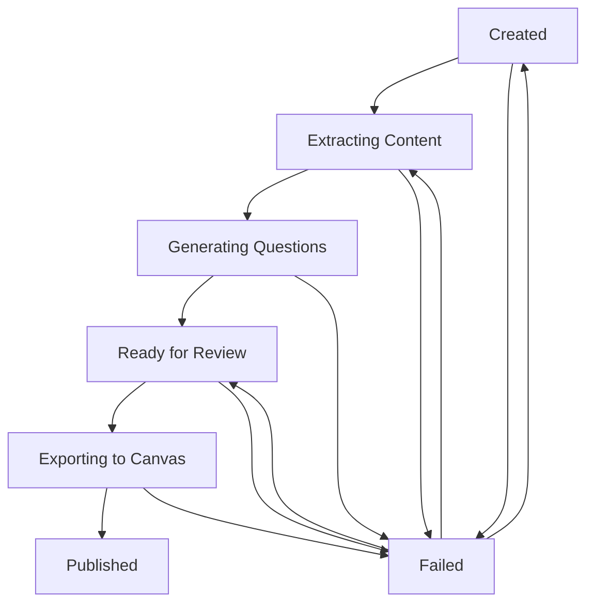

# Consolidated Quiz Status System Implementation Specification

## Overview

This document provides a detailed specification for transforming the current 3-field status system (`content_extraction_status`, `llm_generation_status`, `export_status`) into a single consolidated status field with 7 states, along with updating the frontend status light to a 4-color system.

## Current State Analysis

### Backend Current Implementation

- **3 Status Fields**: `content_extraction_status`, `llm_generation_status`, `export_status`
- **Status Values**: `pending`, `processing`, `completed`, `failed`
- **Status Enum**: Defined in `backend/src/quiz/schemas.py`
- **Database**: String fields with indexes
- **Orchestrator**: Uses transaction boundaries and row locking
- **Validation**: Strong state transition validation

### Frontend Current Implementation

- **StatusLight Component**: 3-color system (red/orange/green)
- **Status Constants**: `PROCESSING_STATUSES` in `frontend/src/lib/constants/index.ts`
- **Utility Functions**: Comprehensive status checking and filtering
- **Components**: Multiple components depend on dual-status logic

## Target State Design

### New Status Enum

```python
class QuizStatus(str, Enum):
    CREATED = "created"                    # Initial state when quiz is created
    EXTRACTING_CONTENT = "extracting_content"  # Content extraction in progress
    GENERATING_QUESTIONS = "generating_questions"  # LLM generation in progress
    READY_FOR_REVIEW = "ready_for_review"  # Questions generated, awaiting user review
    EXPORTING_TO_CANVAS = "exporting_to_canvas"  # Canvas export in progress
    PUBLISHED = "published"                # Final state - quiz exported to Canvas
    FAILED = "failed"                      # Any process failed
```

### New Failure Reason Enum

```python
class FailureReason(str, Enum):
    CONTENT_EXTRACTION_ERROR = "content_extraction_error"
    NO_CONTENT_FOUND = "no_content_found"
    LLM_GENERATION_ERROR = "llm_generation_error"
    NO_QUESTIONS_GENERATED = "no_questions_generated"
    CANVAS_EXPORT_ERROR = "canvas_export_error"
    NETWORK_ERROR = "network_error"
    VALIDATION_ERROR = "validation_error"
```

### Status Light Color Mapping

- 🔴 **Red**: `failed` - Any process failed
- 🟠 **Orange**: `created`, `extracting_content`, `generating_questions` - Pending/In progress
- 🟡 **Yellow**: `exporting_to_canvas` - Exporting to Canvas
- 🟣 **Purple**: `ready_for_review` - Awaiting user review
- 🟢 **Green**: `published` - Published to Canvas

## State Transition Flow

### Automatic Transitions

1. `created` → `extracting_content` (when content extraction starts)
2. `extracting_content` → `generating_questions` (when extraction completes successfully)
3. `generating_questions` → `ready_for_review` (when generation completes successfully)
4. `exporting_to_canvas` → `published` (when export completes successfully)

### Manual Transitions

- `ready_for_review` → `exporting_to_canvas` (user action after approving questions)

### Error Transitions

- Any state → `failed` (when errors occur with appropriate failure_reason)

### Retry Transitions

- `failed` → appropriate previous state (when retry is triggered)

## Detailed Implementation Phases

## Phase 1: Backend Schema & Database Changes

### Phase 1.1: Update Quiz Model Schema and Status Enums

#### File: `backend/src/quiz/models.py`

**Current Implementation:**

```python
class Quiz(SQLModel, table=True):
    id: int | None = Field(default=None, primary_key=True)
    title: str
    content_extraction_status: str = Field(default="pending", index=True)
    llm_generation_status: str = Field(default="pending", index=True)
    export_status: str = Field(default="pending", index=True)
    # ... other fields
```

**New Implementation:**

```python
from .schemas import QuizStatus, FailureReason

class Quiz(SQLModel, table=True):
    id: int | None = Field(default=None, primary_key=True)
    title: str
    status: QuizStatus = Field(default=QuizStatus.CREATED, index=True)
    failure_reason: FailureReason | None = Field(default=None, index=True)
    last_status_update: datetime = Field(default_factory=datetime.utcnow, index=True)
    # ... other fields (remove old status fields)
```

#### File: `backend/src/quiz/schemas.py`

**Current Implementation:**

```python
class Status(str, Enum):
    PENDING = "pending"
    PROCESSING = "processing"
    COMPLETED = "completed"
    FAILED = "failed"
```

**New Implementation:**

```python
class QuizStatus(str, Enum):
    CREATED = "created"
    EXTRACTING_CONTENT = "extracting_content"
    GENERATING_QUESTIONS = "generating_questions"
    READY_FOR_REVIEW = "ready_for_review"
    EXPORTING_TO_CANVAS = "exporting_to_canvas"
    PUBLISHED = "published"
    FAILED = "failed"

class FailureReason(str, Enum):
    CONTENT_EXTRACTION_ERROR = "content_extraction_error"
    NO_CONTENT_FOUND = "no_content_found"
    LLM_GENERATION_ERROR = "llm_generation_error"
    NO_QUESTIONS_GENERATED = "no_questions_generated"
    CANVAS_EXPORT_ERROR = "canvas_export_error"
    NETWORK_ERROR = "network_error"
    VALIDATION_ERROR = "validation_error"

# Remove old Status enum
```

### Phase 1.2: Database Migration

**Commands to Run:**

```bash
cd backend
source .venv/bin/activate
alembic revision --autogenerate -m "add consolidated status and failure reason fields"
alembic upgrade head
```

**Expected Migration File Content:**

```python
def upgrade():
    # Add new columns
    op.add_column('quiz', sa.Column('status', sa.String(), nullable=False, server_default='created'))
    op.add_column('quiz', sa.Column('failure_reason', sa.String(), nullable=True))
    op.add_column('quiz', sa.Column('last_status_update', sa.DateTime(), nullable=False, server_default=sa.func.now()))

    # Add indexes
    op.create_index('idx_quiz_status', 'quiz', ['status'])
    op.create_index('idx_quiz_failure_reason', 'quiz', ['failure_reason'])
    op.create_index('idx_quiz_last_status_update', 'quiz', ['last_status_update'])

    # Drop old columns
    op.drop_index('idx_quiz_content_extraction_status', 'quiz')
    op.drop_index('idx_quiz_llm_generation_status', 'quiz')
    op.drop_index('idx_quiz_export_status', 'quiz')
    op.drop_column('quiz', 'content_extraction_status')
    op.drop_column('quiz', 'llm_generation_status')
    op.drop_column('quiz', 'export_status')
```

## Phase 2: Backend Service Layer Updates

### Phase 2.1: Update Quiz Service

#### File: `backend/src/quiz/service.py`

**Current Implementation:**

```python
def update_quiz_status(
    quiz_id: int,
    content_extraction_status: str | None = None,
    llm_generation_status: str | None = None,
    export_status: str | None = None,
    db: Session = Depends(get_db)
) -> Quiz:
    # Current implementation with multiple status fields
```

**New Implementation:**

```python
def update_quiz_status(
    quiz_id: int,
    status: QuizStatus,
    failure_reason: FailureReason | None = None,
    db: Session = Depends(get_db)
) -> Quiz:
    """Update quiz status with automatic timestamp"""
    quiz = db.get(Quiz, quiz_id)
    if not quiz:
        raise HTTPException(status_code=404, detail="Quiz not found")

    quiz.status = status
    quiz.failure_reason = failure_reason
    quiz.last_status_update = datetime.utcnow()

    db.add(quiz)
    db.commit()
    db.refresh(quiz)

    logger.info(f"Quiz {quiz_id} status updated to {status}", extra={
        "quiz_id": quiz_id,
        "status": status,
        "failure_reason": failure_reason
    })

    return quiz

def set_quiz_failed(
    quiz_id: int,
    failure_reason: FailureReason,
    db: Session = Depends(get_db)
) -> Quiz:
    """Set quiz status to failed with specific reason"""
    return update_quiz_status(quiz_id, QuizStatus.FAILED, failure_reason, db)

def reset_quiz_for_retry(
    quiz_id: int,
    db: Session = Depends(get_db)
) -> Quiz:
    """Reset quiz for retry based on failure reason"""
    quiz = db.get(Quiz, quiz_id)
    if not quiz:
        raise HTTPException(status_code=404, detail="Quiz not found")

    if quiz.status != QuizStatus.FAILED:
        raise HTTPException(status_code=400, detail="Quiz is not in failed state")

    # Determine retry status based on failure reason
    if quiz.failure_reason in [FailureReason.CONTENT_EXTRACTION_ERROR, FailureReason.NO_CONTENT_FOUND]:
        retry_status = QuizStatus.CREATED
        # Reset extracted content
        quiz.extracted_modules = []
    elif quiz.failure_reason in [FailureReason.LLM_GENERATION_ERROR, FailureReason.NO_QUESTIONS_GENERATED]:
        retry_status = QuizStatus.EXTRACTING_CONTENT
        # Reset questions
        quiz.questions = []
    elif quiz.failure_reason == FailureReason.CANVAS_EXPORT_ERROR:
        retry_status = QuizStatus.READY_FOR_REVIEW
    else:
        retry_status = QuizStatus.CREATED

    return update_quiz_status(quiz_id, retry_status, None, db)

def reserve_quiz_job(
    quiz_id: int,
    target_status: QuizStatus,
    db: Session = Depends(get_db)
) -> Quiz:
    """Reserve quiz job with status transition"""
    quiz = db.execute(
        select(Quiz).where(Quiz.id == quiz_id).with_for_update()
    ).scalar_one_or_none()

    if not quiz:
        raise HTTPException(status_code=404, detail="Quiz not found")

    # Validate transition
    if not _is_valid_transition(quiz.status, target_status):
        raise HTTPException(
            status_code=400,
            detail=f"Invalid transition from {quiz.status} to {target_status}"
        )

    quiz.status = target_status
    quiz.last_status_update = datetime.utcnow()
    quiz.failure_reason = None  # Clear previous failure reason

    db.add(quiz)
    db.commit()
    db.refresh(quiz)

    return quiz

def _is_valid_transition(current: QuizStatus, target: QuizStatus) -> bool:
    """Validate status transitions"""
    valid_transitions = {
        QuizStatus.CREATED: [QuizStatus.EXTRACTING_CONTENT, QuizStatus.FAILED],
        QuizStatus.EXTRACTING_CONTENT: [QuizStatus.GENERATING_QUESTIONS, QuizStatus.FAILED],
        QuizStatus.GENERATING_QUESTIONS: [QuizStatus.READY_FOR_REVIEW, QuizStatus.FAILED],
        QuizStatus.READY_FOR_REVIEW: [QuizStatus.EXPORTING_TO_CANVAS, QuizStatus.FAILED],
        QuizStatus.EXPORTING_TO_CANVAS: [QuizStatus.PUBLISHED, QuizStatus.FAILED],
        QuizStatus.FAILED: [QuizStatus.CREATED, QuizStatus.EXTRACTING_CONTENT, QuizStatus.READY_FOR_REVIEW],
        QuizStatus.PUBLISHED: []  # Terminal state
    }

    return target in valid_transitions.get(current, [])
```

### Phase 2.2: Update Orchestrator

#### File: `backend/src/quiz/orchestrator.py`

**Current Implementation:**

```python
async def extract_content_from_modules(quiz_id: int, db: Session):
    # Update content_extraction_status to "processing"
    # ... extraction logic
    # Update content_extraction_status to "completed" or "failed"
    # Trigger question generation if successful
```

**New Implementation:**

```python
async def extract_content_from_modules(quiz_id: int, db: Session):
    """Extract content with consolidated status tracking"""
    try:
        # Reserve job
        quiz = reserve_quiz_job(quiz_id, QuizStatus.EXTRACTING_CONTENT, db)

        # Perform extraction
        extracted_content = await _perform_content_extraction(quiz)

        if not extracted_content:
            set_quiz_failed(quiz_id, FailureReason.NO_CONTENT_FOUND, db)
            return

        # Update quiz with extracted content
        quiz.extracted_modules = extracted_content
        db.add(quiz)
        db.commit()

        # Transition to next state
        update_quiz_status(quiz_id, QuizStatus.GENERATING_QUESTIONS, None, db)

        # Trigger question generation
        await generate_questions_for_quiz(quiz_id, db)

    except ContentExtractionError as e:
        logger.error(f"Content extraction failed for quiz {quiz_id}: {e}")
        set_quiz_failed(quiz_id, FailureReason.CONTENT_EXTRACTION_ERROR, db)
    except Exception as e:
        logger.error(f"Unexpected error during content extraction for quiz {quiz_id}: {e}")
        set_quiz_failed(quiz_id, FailureReason.CONTENT_EXTRACTION_ERROR, db)

async def generate_questions_for_quiz(quiz_id: int, db: Session):
    """Generate questions with consolidated status tracking"""
    try:
        quiz = db.get(Quiz, quiz_id)
        if not quiz:
            raise HTTPException(status_code=404, detail="Quiz not found")

        # Validate current status
        if quiz.status != QuizStatus.GENERATING_QUESTIONS:
            logger.warning(f"Quiz {quiz_id} not in generating_questions state: {quiz.status}")
            return

        # Perform question generation
        generated_questions = await _perform_question_generation(quiz)

        if not generated_questions:
            set_quiz_failed(quiz_id, FailureReason.NO_QUESTIONS_GENERATED, db)
            return

        # Save questions
        for question_data in generated_questions:
            question = Question(**question_data, quiz_id=quiz_id)
            db.add(question)

        db.commit()

        # Transition to ready for review
        update_quiz_status(quiz_id, QuizStatus.READY_FOR_REVIEW, None, db)

    except LLMGenerationError as e:
        logger.error(f"Question generation failed for quiz {quiz_id}: {e}")
        set_quiz_failed(quiz_id, FailureReason.LLM_GENERATION_ERROR, db)
    except Exception as e:
        logger.error(f"Unexpected error during question generation for quiz {quiz_id}: {e}")
        set_quiz_failed(quiz_id, FailureReason.LLM_GENERATION_ERROR, db)

async def export_quiz_to_canvas(quiz_id: int, db: Session):
    """Export quiz to Canvas with consolidated status tracking"""
    try:
        # Reserve job
        quiz = reserve_quiz_job(quiz_id, QuizStatus.EXPORTING_TO_CANVAS, db)

        # Validate approved questions exist
        approved_questions = db.execute(
            select(Question).where(
                Question.quiz_id == quiz_id,
                Question.is_approved == True
            )
        ).scalars().all()

        if not approved_questions:
            set_quiz_failed(quiz_id, FailureReason.VALIDATION_ERROR, db)
            return

        # Perform Canvas export
        canvas_quiz_id = await _perform_canvas_export(quiz, approved_questions)

        # Update quiz with Canvas ID
        quiz.canvas_quiz_id = canvas_quiz_id
        db.add(quiz)
        db.commit()

        # Transition to published
        update_quiz_status(quiz_id, QuizStatus.PUBLISHED, None, db)

    except CanvasExportError as e:
        logger.error(f"Canvas export failed for quiz {quiz_id}: {e}")
        set_quiz_failed(quiz_id, FailureReason.CANVAS_EXPORT_ERROR, db)
    except Exception as e:
        logger.error(f"Unexpected error during Canvas export for quiz {quiz_id}: {e}")
        set_quiz_failed(quiz_id, FailureReason.CANVAS_EXPORT_ERROR, db)
```

### Phase 2.3: Update Validators

#### File: `backend/src/quiz/validators.py`

**Current Implementation:**

```python
def is_quiz_ready_for_extraction(quiz: Quiz) -> bool:
    return quiz.content_extraction_status != "processing"

def is_quiz_ready_for_generation(quiz: Quiz) -> bool:
    return (quiz.content_extraction_status == "completed" and
            quiz.llm_generation_status != "processing")
```

**New Implementation:**

```python
def is_quiz_ready_for_extraction(quiz: Quiz) -> bool:
    """Check if quiz is ready for content extraction"""
    return quiz.status in [QuizStatus.CREATED, QuizStatus.FAILED]

def is_quiz_ready_for_generation(quiz: Quiz) -> bool:
    """Check if quiz is ready for question generation"""
    return quiz.status == QuizStatus.EXTRACTING_CONTENT

def is_quiz_ready_for_export(quiz: Quiz) -> bool:
    """Check if quiz is ready for Canvas export"""
    return quiz.status == QuizStatus.READY_FOR_REVIEW

def is_quiz_ready_for_retry(quiz: Quiz) -> bool:
    """Check if quiz can be retried"""
    return quiz.status == QuizStatus.FAILED

def validate_status_transition(current: QuizStatus, target: QuizStatus) -> bool:
    """Validate if status transition is allowed"""
    return _is_valid_transition(current, target)

def get_quiz_processing_phase(quiz: Quiz) -> str:
    """Get human-readable processing phase"""
    phase_map = {
        QuizStatus.CREATED: "Ready to start",
        QuizStatus.EXTRACTING_CONTENT: "Extracting content from modules",
        QuizStatus.GENERATING_QUESTIONS: "Generating questions with AI",
        QuizStatus.READY_FOR_REVIEW: "Ready for question review",
        QuizStatus.EXPORTING_TO_CANVAS: "Exporting to Canvas",
        QuizStatus.PUBLISHED: "Published to Canvas",
        QuizStatus.FAILED: "Generation failed"
    }
    return phase_map.get(quiz.status, "Unknown")
```

## Phase 3: Backend API Updates

### Phase 3.1: Update API Schemas

#### File: `backend/src/quiz/schemas.py`

**Current Implementation:**

```python
class QuizPublic(BaseModel):
    id: int
    title: str
    content_extraction_status: str
    llm_generation_status: str
    export_status: str
    # ... other fields
```

**New Implementation:**

```python
class QuizPublic(BaseModel):
    id: int
    title: str
    status: QuizStatus
    failure_reason: FailureReason | None = None
    last_status_update: datetime
    # ... other fields (remove old status fields)

class QuizStatusUpdate(BaseModel):
    status: QuizStatus
    failure_reason: FailureReason | None = None

class QuizRetryRequest(BaseModel):
    """Request to retry a failed quiz"""
    pass  # Empty body for now, could add options later

class QuizStatusFilter(BaseModel):
    """Filter quizzes by status"""
    status: QuizStatus | None = None
    failure_reason: FailureReason | None = None
```

### Phase 3.2: Update API Endpoints

#### File: `backend/src/quiz/router.py`

**Current Implementation:**

```python
@router.post("/{quiz_id}/extract-content")
async def extract_content(quiz_id: int, db: Session = Depends(get_db)):
    # Current implementation
```

**New Implementation:**

```python
@router.post("/{quiz_id}/extract-content")
async def extract_content(
    quiz_id: int,
    background_tasks: BackgroundTasks,
    db: Session = Depends(get_db),
    current_user: User = Depends(get_current_user)
):
    """Start content extraction for a quiz"""
    quiz = db.get(Quiz, quiz_id)
    if not quiz:
        raise HTTPException(status_code=404, detail="Quiz not found")

    # Validate ownership
    if quiz.user_id != current_user.id:
        raise HTTPException(status_code=403, detail="Not authorized")

    # Validate status
    if not is_quiz_ready_for_extraction(quiz):
        raise HTTPException(
            status_code=400,
            detail=f"Quiz is not ready for extraction. Current status: {quiz.status}"
        )

    # Start extraction in background
    background_tasks.add_task(extract_content_from_modules, quiz_id, db)

    return {"message": "Content extraction started", "quiz_id": quiz_id}

@router.post("/{quiz_id}/export")
async def export_to_canvas(
    quiz_id: int,
    background_tasks: BackgroundTasks,
    db: Session = Depends(get_db),
    current_user: User = Depends(get_current_user)
):
    """Export quiz to Canvas"""
    quiz = db.get(Quiz, quiz_id)
    if not quiz:
        raise HTTPException(status_code=404, detail="Quiz not found")

    # Validate ownership
    if quiz.user_id != current_user.id:
        raise HTTPException(status_code=403, detail="Not authorized")

    # Validate status
    if not is_quiz_ready_for_export(quiz):
        raise HTTPException(
            status_code=400,
            detail=f"Quiz is not ready for export. Current status: {quiz.status}"
        )

    # Start export in background
    background_tasks.add_task(export_quiz_to_canvas, quiz_id, db)

    return {"message": "Canvas export started", "quiz_id": quiz_id}

@router.post("/{quiz_id}/retry")
async def retry_quiz(
    quiz_id: int,
    background_tasks: BackgroundTasks,
    db: Session = Depends(get_db),
    current_user: User = Depends(get_current_user)
):
    """Retry a failed quiz"""
    quiz = db.get(Quiz, quiz_id)
    if not quiz:
        raise HTTPException(status_code=404, detail="Quiz not found")

    # Validate ownership
    if quiz.user_id != current_user.id:
        raise HTTPException(status_code=403, detail="Not authorized")

    # Validate status
    if not is_quiz_ready_for_retry(quiz):
        raise HTTPException(
            status_code=400,
            detail=f"Quiz cannot be retried. Current status: {quiz.status}"
        )

    # Reset quiz for retry
    updated_quiz = reset_quiz_for_retry(quiz_id, db)

    # Start appropriate process based on retry status
    if updated_quiz.status == QuizStatus.CREATED:
        background_tasks.add_task(extract_content_from_modules, quiz_id, db)
    elif updated_quiz.status == QuizStatus.EXTRACTING_CONTENT:
        background_tasks.add_task(generate_questions_for_quiz, quiz_id, db)

    return {"message": "Quiz retry started", "quiz_id": quiz_id, "status": updated_quiz.status}

@router.get("/by-status/{status}")
async def get_quizzes_by_status(
    status: QuizStatus,
    db: Session = Depends(get_db),
    current_user: User = Depends(get_current_user)
):
    """Get quizzes filtered by status"""
    quizzes = db.execute(
        select(Quiz).where(
            Quiz.user_id == current_user.id,
            Quiz.status == status
        ).order_by(Quiz.last_status_update.desc())
    ).scalars().all()

    return quizzes
```

### Phase 3.3: Update Dependencies

#### File: `backend/src/quiz/dependencies.py`

**Current Implementation:**

```python
def validate_content_extraction_ready(quiz: Quiz = Depends(get_quiz)):
    if quiz.content_extraction_status == "processing":
        raise HTTPException(status_code=400, detail="Content extraction already in progress")
    return quiz
```

**New Implementation:**

```python
def validate_content_extraction_ready(quiz: Quiz = Depends(get_quiz)):
    """Validate quiz is ready for content extraction"""
    if not is_quiz_ready_for_extraction(quiz):
        raise HTTPException(
            status_code=400,
            detail=f"Quiz is not ready for extraction. Current status: {quiz.status}"
        )
    return quiz

def validate_question_generation_ready(quiz: Quiz = Depends(get_quiz)):
    """Validate quiz is ready for question generation"""
    if not is_quiz_ready_for_generation(quiz):
        raise HTTPException(
            status_code=400,
            detail=f"Quiz is not ready for generation. Current status: {quiz.status}"
        )
    return quiz

def validate_export_ready(quiz: Quiz = Depends(get_quiz)):
    """Validate quiz is ready for Canvas export"""
    if not is_quiz_ready_for_export(quiz):
        raise HTTPException(
            status_code=400,
            detail=f"Quiz is not ready for export. Current status: {quiz.status}"
        )
    return quiz

def validate_retry_ready(quiz: Quiz = Depends(get_quiz)):
    """Validate quiz can be retried"""
    if not is_quiz_ready_for_retry(quiz):
        raise HTTPException(
            status_code=400,
            detail=f"Quiz cannot be retried. Current status: {quiz.status}"
        )
    return quiz
```

## Phase 4: Frontend Type Updates

### Phase 4.1: Regenerate API Client

**Command:**

```bash
cd frontend
npm run generate-client
```

**Expected Changes in `frontend/src/client/types.gen.ts`:**

```typescript
export interface Quiz {
  id: number;
  title: string;
  status: QuizStatus;
  failure_reason?: FailureReason | null;
  last_status_update: string;
  // ... other fields
}

export enum QuizStatus {
  CREATED = "created",
  EXTRACTING_CONTENT = "extracting_content",
  GENERATING_QUESTIONS = "generating_questions",
  READY_FOR_REVIEW = "ready_for_review",
  EXPORTING_TO_CANVAS = "exporting_to_canvas",
  PUBLISHED = "published",
  FAILED = "failed",
}

export enum FailureReason {
  CONTENT_EXTRACTION_ERROR = "content_extraction_error",
  NO_CONTENT_FOUND = "no_content_found",
  LLM_GENERATION_ERROR = "llm_generation_error",
  NO_QUESTIONS_GENERATED = "no_questions_generated",
  CANVAS_EXPORT_ERROR = "canvas_export_error",
  NETWORK_ERROR = "network_error",
  VALIDATION_ERROR = "validation_error",
}
```

### Phase 4.2: Update Frontend Constants

#### File: `frontend/src/lib/constants/index.ts`

**Current Implementation:**

```typescript
export const PROCESSING_STATUSES = {
  PENDING: "pending",
  PROCESSING: "processing",
  COMPLETED: "completed",
  FAILED: "failed",
} as const;
```

**New Implementation:**

```typescript
import { QuizStatus, FailureReason } from "@/client/types.gen";

export const QUIZ_STATUS = {
  CREATED: QuizStatus.CREATED,
  EXTRACTING_CONTENT: QuizStatus.EXTRACTING_CONTENT,
  GENERATING_QUESTIONS: QuizStatus.GENERATING_QUESTIONS,
  READY_FOR_REVIEW: QuizStatus.READY_FOR_REVIEW,
  EXPORTING_TO_CANVAS: QuizStatus.EXPORTING_TO_CANVAS,
  PUBLISHED: QuizStatus.PUBLISHED,
  FAILED: QuizStatus.FAILED,
} as const;

export const FAILURE_REASON = {
  CONTENT_EXTRACTION_ERROR: FailureReason.CONTENT_EXTRACTION_ERROR,
  NO_CONTENT_FOUND: FailureReason.NO_CONTENT_FOUND,
  LLM_GENERATION_ERROR: FailureReason.LLM_GENERATION_ERROR,
  NO_QUESTIONS_GENERATED: FailureReason.NO_QUESTIONS_GENERATED,
  CANVAS_EXPORT_ERROR: FailureReason.CANVAS_EXPORT_ERROR,
  NETWORK_ERROR: FailureReason.NETWORK_ERROR,
  VALIDATION_ERROR: FailureReason.VALIDATION_ERROR,
} as const;

export const STATUS_COLORS = {
  [QUIZ_STATUS.CREATED]: "orange.500",
  [QUIZ_STATUS.EXTRACTING_CONTENT]: "orange.500",
  [QUIZ_STATUS.GENERATING_QUESTIONS]: "orange.500",
  [QUIZ_STATUS.READY_FOR_REVIEW]: "purple.500",
  [QUIZ_STATUS.EXPORTING_TO_CANVAS]: "yellow.500",
  [QUIZ_STATUS.PUBLISHED]: "green.500",
  [QUIZ_STATUS.FAILED]: "red.500",
} as const;

export const STATUS_LABELS = {
  [QUIZ_STATUS.CREATED]: "Ready to start",
  [QUIZ_STATUS.EXTRACTING_CONTENT]: "Extracting content",
  [QUIZ_STATUS.GENERATING_QUESTIONS]: "Generating questions",
  [QUIZ_STATUS.READY_FOR_REVIEW]: "Ready for review",
  [QUIZ_STATUS.EXPORTING_TO_CANVAS]: "Exporting to Canvas",
  [QUIZ_STATUS.PUBLISHED]: "Published",
  [QUIZ_STATUS.FAILED]: "Failed",
} as const;

export const FAILURE_REASON_MESSAGES = {
  [FAILURE_REASON.CONTENT_EXTRACTION_ERROR]:
    "Failed to extract content from modules",
  [FAILURE_REASON.NO_CONTENT_FOUND]: "No content found in selected modules",
  [FAILURE_REASON.LLM_GENERATION_ERROR]: "AI question generation failed",
  [FAILURE_REASON.NO_QUESTIONS_GENERATED]: "No questions could be generated",
  [FAILURE_REASON.CANVAS_EXPORT_ERROR]: "Failed to export to Canvas",
  [FAILURE_REASON.NETWORK_ERROR]: "Network error occurred",
  [FAILURE_REASON.VALIDATION_ERROR]: "Validation error occurred",
} as const;

// Remove old PROCESSING_STATUSES
```

## Phase 5: Frontend Component Updates

### Phase 5.1: Update StatusLight Component

#### File: `frontend/src/components/ui/status-light.tsx`

**Current Implementation:**

```typescript
interface StatusLightProps {
  extractionStatus: string;
  generationStatus: string;
}

export function StatusLight({
  extractionStatus,
  generationStatus,
}: StatusLightProps) {
  const getStatusColor = () => {
    if (extractionStatus === "failed" || generationStatus === "failed") {
      return "red.500";
    }
    if (extractionStatus === "completed" && generationStatus === "completed") {
      return "green.500";
    }
    return "orange.500";
  };
  // ... rest of component
}
```

**New Implementation:**

```typescript
import { QuizStatus } from "@/client/types.gen";
import { QUIZ_STATUS, STATUS_COLORS, STATUS_LABELS } from "@/lib/constants";
import { Box } from "@chakra-ui/react";

/**
 * Props for the StatusLight component.
 * Displays a colored status indicator based on consolidated quiz status.
 *
 * Status colors:
 * - 🔴 Red: Failed
 * - 🟠 Orange: Created, extracting content, generating questions
 * - 🟡 Yellow: Exporting to Canvas
 * - 🟣 Purple: Ready for review
 * - 🟢 Green: Published
 */
interface StatusLightProps {
  /** Current quiz status */
  status: QuizStatus;
  /** Whether the status light should be clickable */
  onClick?: () => void;
  /** Size of the status light */
  size?: "sm" | "md" | "lg";
}

export function StatusLight({
  status,
  onClick,
  size = "md",
}: StatusLightProps) {
  const getStatusColor = () => {
    return STATUS_COLORS[status] || "gray.500";
  };

  const getStatusTitle = () => {
    return STATUS_LABELS[status] || "Unknown status";
  };

  const sizeMap = {
    sm: "12px",
    md: "16px",
    lg: "24px",
  };

  return (
    <Box
      width={sizeMap[size]}
      height={sizeMap[size]}
      borderRadius="full"
      bg={getStatusColor()}
      title={getStatusTitle()}
      cursor={onClick ? "pointer" : "help"}
      flexShrink={0}
      boxShadow={`0 0 8px ${getStatusColor()}`}
      onClick={onClick}
      transition="all 0.2s"
      _hover={
        onClick
          ? {
              transform: "scale(1.1)",
              boxShadow: `0 0 12px ${getStatusColor()}`,
            }
          : undefined
      }
      _active={
        onClick
          ? {
              transform: "scale(0.95)",
            }
          : undefined
      }
    />
  );
}
```

### Phase 5.2: Update Status Description Component

#### File: `frontend/src/components/ui/status-description.tsx`

**Current Implementation:**

```typescript
interface StatusDescriptionProps {
  status: string;
  type: "extraction" | "generation" | "export";
}

export function StatusDescription({ status, type }: StatusDescriptionProps) {
  // Current implementation with type-specific descriptions
}
```

**New Implementation:**

```typescript
import { QuizStatus, FailureReason } from "@/client/types.gen";
import { STATUS_LABELS, FAILURE_REASON_MESSAGES } from "@/lib/constants";
import { Box, Text, Badge } from "@chakra-ui/react";

interface StatusDescriptionProps {
  /** Current quiz status */
  status: QuizStatus;
  /** Failure reason if status is failed */
  failureReason?: FailureReason | null;
  /** Last status update timestamp */
  lastUpdated?: string;
  /** Whether to show detailed description */
  detailed?: boolean;
}

export function StatusDescription({
  status,
  failureReason,
  lastUpdated,
  detailed = false,
}: StatusDescriptionProps) {
  const getStatusDescription = () => {
    const baseDescription = STATUS_LABELS[status];

    if (status === QuizStatus.FAILED && failureReason) {
      return FAILURE_REASON_MESSAGES[failureReason];
    }

    if (detailed) {
      const detailedDescriptions = {
        [QuizStatus.CREATED]:
          "Quiz created and ready to start content extraction",
        [QuizStatus.EXTRACTING_CONTENT]:
          "Extracting content from selected Canvas modules",
        [QuizStatus.GENERATING_QUESTIONS]:
          "AI is generating multiple-choice questions",
        [QuizStatus.READY_FOR_REVIEW]:
          "Questions generated successfully, ready for review",
        [QuizStatus.EXPORTING_TO_CANVAS]:
          "Exporting approved questions to Canvas",
        [QuizStatus.PUBLISHED]: "Quiz successfully published to Canvas",
        [QuizStatus.FAILED]: "Process failed - check error details",
      };
      return detailedDescriptions[status] || baseDescription;
    }

    return baseDescription;
  };

  const getStatusColor = () => {
    const colorMap = {
      [QuizStatus.CREATED]: "orange",
      [QuizStatus.EXTRACTING_CONTENT]: "orange",
      [QuizStatus.GENERATING_QUESTIONS]: "orange",
      [QuizStatus.READY_FOR_REVIEW]: "purple",
      [QuizStatus.EXPORTING_TO_CANVAS]: "yellow",
      [QuizStatus.PUBLISHED]: "green",
      [QuizStatus.FAILED]: "red",
    };
    return colorMap[status] || "gray";
  };

  const formatTimestamp = (timestamp: string) => {
    return new Date(timestamp).toLocaleString();
  };

  return (
    <Box>
      <Box display="flex" alignItems="center" gap={2} mb={1}>
        <Badge colorScheme={getStatusColor()} variant="subtle">
          {STATUS_LABELS[status]}
        </Badge>
        {lastUpdated && (
          <Text fontSize="xs" color="gray.500">
            {formatTimestamp(lastUpdated)}
          </Text>
        )}
      </Box>

      <Text fontSize="sm" color="gray.600">
        {getStatusDescription()}
      </Text>

      {status === QuizStatus.FAILED && failureReason && (
        <Text fontSize="xs" color="red.500" mt={1}>
          Error: {FAILURE_REASON_MESSAGES[failureReason]}
        </Text>
      )}
    </Box>
  );
}
```

### Phase 5.3: Update Quiz Utility Functions

#### File: `frontend/src/lib/utils/quiz.ts`

**Current Implementation:**

```typescript
import { PROCESSING_STATUSES } from "@/lib/constants";

export function hasQuizFailed(quiz: Quiz): boolean {
  return (
    quiz.content_extraction_status === PROCESSING_STATUSES.FAILED ||
    quiz.llm_generation_status === PROCESSING_STATUSES.FAILED
  );
}

export function isQuizComplete(quiz: Quiz): boolean {
  return (
    quiz.content_extraction_status === PROCESSING_STATUSES.COMPLETED &&
    quiz.llm_generation_status === PROCESSING_STATUSES.COMPLETED
  );
}
```

**New Implementation:**

```typescript
import { Quiz, QuizStatus, FailureReason } from "@/client/types.gen";
import { QUIZ_STATUS } from "@/lib/constants";

export function hasQuizFailed(quiz: Quiz): boolean {
  return quiz.status === QUIZ_STATUS.FAILED;
}

export function isQuizComplete(quiz: Quiz): boolean {
  return (
    quiz.status === QUIZ_STATUS.READY_FOR_REVIEW ||
    quiz.status === QUIZ_STATUS.EXPORTING_TO_CANVAS ||
    quiz.status === QUIZ_STATUS.PUBLISHED
  );
}

export function isQuizProcessing(quiz: Quiz): boolean {
  return (
    quiz.status === QUIZ_STATUS.EXTRACTING_CONTENT ||
    quiz.status === QUIZ_STATUS.GENERATING_QUESTIONS ||
    quiz.status === QUIZ_STATUS.EXPORTING_TO_CANVAS
  );
}

export function isQuizPublished(quiz: Quiz): boolean {
  return quiz.status === QUIZ_STATUS.PUBLISHED;
}

export function isQuizReadyForReview(quiz: Quiz): boolean {
  return quiz.status === QUIZ_STATUS.READY_FOR_REVIEW;
}

export function isQuizReadyForExport(quiz: Quiz): boolean {
  return quiz.status === QUIZ_STATUS.READY_FOR_REVIEW;
}

export function canQuizBeRetried(quiz: Quiz): boolean {
  return quiz.status === QUIZ_STATUS.FAILED;
}

export function getQuizProgressPercentage(quiz: Quiz): number {
  const progressMap = {
    [QUIZ_STATUS.CREATED]: 0,
    [QUIZ_STATUS.EXTRACTING_CONTENT]: 25,
    [QUIZ_STATUS.GENERATING_QUESTIONS]: 50,
    [QUIZ_STATUS.READY_FOR_REVIEW]: 75,
    [QUIZ_STATUS.EXPORTING_TO_CANVAS]: 90,
    [QUIZ_STATUS.PUBLISHED]: 100,
    [QUIZ_STATUS.FAILED]: 0,
  };
  return progressMap[quiz.status] || 0;
}

export function getQuizStatusColor(quiz: Quiz): string {
  return STATUS_COLORS[quiz.status] || "gray.500";
}

export function getQuizStatusText(quiz: Quiz): string {
  return STATUS_LABELS[quiz.status] || "Unknown";
}

export function getQuizFailureMessage(quiz: Quiz): string | null {
  if (quiz.status !== QUIZ_STATUS.FAILED || !quiz.failure_reason) {
    return null;
  }
  return FAILURE_REASON_MESSAGES[quiz.failure_reason] || "Unknown error";
}

// Filtering functions for different quiz lists
export function getQuizzesBeingGenerated(quizzes: Quiz[]): Quiz[] {
  return quizzes.filter((quiz) => isQuizProcessing(quiz));
}

export function getQuizzesNeedingReview(quizzes: Quiz[]): Quiz[] {
  return quizzes.filter((quiz) => isQuizReadyForReview(quiz));
}

export function getFailedQuizzes(quizzes: Quiz[]): Quiz[] {
  return quizzes.filter((quiz) => hasQuizFailed(quiz));
}

export function getPublishedQuizzes(quizzes: Quiz[]): Quiz[] {
  return quizzes.filter((quiz) => isQuizPublished(quiz));
}

export function getPendingQuizzes(quizzes: Quiz[]): Quiz[] {
  return quizzes.filter((quiz) => quiz.status === QUIZ_STATUS.CREATED);
}

export function sortQuizzesByStatus(quizzes: Quiz[]): Quiz[] {
  const statusOrder = {
    [QUIZ_STATUS.FAILED]: 0,
    [QUIZ_STATUS.READY_FOR_REVIEW]: 1,
    [QUIZ_STATUS.EXTRACTING_CONTENT]: 2,
    [QUIZ_STATUS.GENERATING_QUESTIONS]: 3,
    [QUIZ_STATUS.EXPORTING_TO_CANVAS]: 4,
    [QUIZ_STATUS.CREATED]: 5,
    [QUIZ_STATUS.PUBLISHED]: 6,
  };

  return [...quizzes].sort((a, b) => {
    const orderA = statusOrder[a.status] ?? 999;
    const orderB = statusOrder[b.status] ?? 999;

    if (orderA !== orderB) {
      return orderA - orderB;
    }

    // Sort by last updated within same status
    return (
      new Date(b.last_status_update).getTime() -
      new Date(a.last_status_update).getTime()
    );
  });
}
```

## Phase 6: Frontend UI Updates

### Phase 6.1: Update Quiz Components

#### File: `frontend/src/components/Common/QuizTableRow.tsx`

**Current Implementation:**

```typescript
<StatusLight
  extractionStatus={
    quiz.content_extraction_status || PROCESSING_STATUSES.PENDING
  }
  generationStatus={quiz.llm_generation_status || PROCESSING_STATUSES.PENDING}
/>
```

**New Implementation:**

```typescript
import { StatusLight } from "@/components/ui/status-light";
import { StatusDescription } from "@/components/ui/status-description";
import { canQuizBeRetried, getQuizFailureMessage } from "@/lib/utils/quiz";
import { Button } from "@/components/ui/button";

// In the component render:
<StatusLight
  status={quiz.status}
  onClick={() => setShowStatusDetails(!showStatusDetails)}
/>;

{
  showStatusDetails && (
    <StatusDescription
      status={quiz.status}
      failureReason={quiz.failure_reason}
      lastUpdated={quiz.last_status_update}
      detailed={true}
    />
  );
}

{
  canQuizBeRetried(quiz) && (
    <Button
      size="sm"
      colorScheme="orange"
      onClick={() => handleRetryQuiz(quiz.id)}
      isLoading={isRetrying}
    >
      Retry
    </Button>
  );
}
```

#### File: `frontend/src/components/dashboard/QuizGenerationCard.tsx`

**Current Implementation:**

```typescript
const processingPhase = getQuizProcessingPhase(quiz);
const progressPercentage = getQuizProgressPercentage(quiz);
```

**New Implementation:**

```typescript
import { getQuizProgressPercentage, getQuizStatusText, canQuizBeRetried } from "@/lib/utils/quiz"
import { useRetryQuiz } from "@/hooks/api/useQuizzes"

const statusText = getQuizStatusText(quiz)
const progressPercentage = getQuizProgressPercentage(quiz)
const canRetry = canQuizBeRetried(quiz)
const { mutate: retryQuiz, isLoading: isRetrying } = useRetryQuiz()

// In the component render:
<Box>
  <StatusLight status={quiz.status} size="lg" />
  <Text fontSize="lg" fontWeight="semibold">{statusText}</Text>

  {quiz.status !== QUIZ_STATUS.FAILED && (
    <Progress value={progressPercentage} colorScheme="blue" size="sm" />
  )}

  {canRetry && (
    <Button
      colorScheme="orange"
      onClick={() => retryQuiz(quiz.id)}
      isLoading={isRetrying}
    >
      Retry Generation
    </Button>
  )}
</Box>
```

### Phase 6.2: Update Status Polling

#### File: `frontend/src/hooks/api/useQuizzes.ts`

**Current Implementation:**

```typescript
export function useQuizStatusPolling(quizId: number) {
  return useQuery({
    queryKey: ["quiz", quizId],
    queryFn: () => QuizService.getQuiz(quizId),
    refetchInterval: 2000,
  });
}
```

**New Implementation:**

```typescript
import { QUIZ_STATUS } from "@/lib/constants";

export function useQuizStatusPolling(quizId: number) {
  return useQuery({
    queryKey: ["quiz", quizId],
    queryFn: () => QuizService.getQuiz(quizId),
    refetchInterval: (data) => {
      if (!data) return 2000;

      // Different polling intervals based on status
      const activeStatuses = [
        QUIZ_STATUS.EXTRACTING_CONTENT,
        QUIZ_STATUS.GENERATING_QUESTIONS,
        QUIZ_STATUS.EXPORTING_TO_CANVAS,
      ];

      if (activeStatuses.includes(data.status)) {
        return 2000; // Poll every 2 seconds for active processes
      }

      if (data.status === QUIZ_STATUS.READY_FOR_REVIEW) {
        return 10000; // Poll every 10 seconds for review state
      }

      // No polling for terminal states
      if (
        data.status === QUIZ_STATUS.PUBLISHED ||
        data.status === QUIZ_STATUS.FAILED
      ) {
        return false;
      }

      return 5000; // Default polling interval
    },
  });
}

export function useRetryQuiz() {
  const queryClient = useQueryClient();

  return useMutation({
    mutationFn: (quizId: number) => QuizService.retryQuiz(quizId),
    onSuccess: (data) => {
      queryClient.invalidateQueries({ queryKey: ["quiz", data.id] });
      queryClient.invalidateQueries({ queryKey: ["quizzes"] });
    },
  });
}

export function useQuizzesByStatus(status?: QuizStatus) {
  return useQuery({
    queryKey: ["quizzes", "by-status", status],
    queryFn: () =>
      status
        ? QuizService.getQuizzesByStatus(status)
        : QuizService.getQuizzes(),
    enabled: !!status,
  });
}
```

## Phase 7: Testing

### Phase 7.1: Backend Integration Tests

#### File: `backend/tests/quiz/test_status_transitions.py`

```python
import pytest
from sqlalchemy.orm import Session
from src.quiz.models import Quiz
from src.quiz.schemas import QuizStatus, FailureReason
from src.quiz.service import update_quiz_status, set_quiz_failed, reset_quiz_for_retry
from src.quiz.orchestrator import extract_content_from_modules, generate_questions_for_quiz

class TestQuizStatusTransitions:
    """Test quiz status transitions and workflows"""

    def test_initial_quiz_status(self, db: Session, sample_quiz: Quiz):
        """Test that new quizzes start with CREATED status"""
        assert sample_quiz.status == QuizStatus.CREATED
        assert sample_quiz.failure_reason is None
        assert sample_quiz.last_status_update is not None

    def test_valid_status_transitions(self, db: Session, sample_quiz: Quiz):
        """Test valid status transitions"""
        # CREATED -> EXTRACTING_CONTENT
        update_quiz_status(sample_quiz.id, QuizStatus.EXTRACTING_CONTENT, db=db)
        db.refresh(sample_quiz)
        assert sample_quiz.status == QuizStatus.EXTRACTING_CONTENT

        # EXTRACTING_CONTENT -> GENERATING_QUESTIONS
        update_quiz_status(sample_quiz.id, QuizStatus.GENERATING_QUESTIONS, db=db)
        db.refresh(sample_quiz)
        assert sample_quiz.status == QuizStatus.GENERATING_QUESTIONS

        # GENERATING_QUESTIONS -> READY_FOR_REVIEW
        update_quiz_status(sample_quiz.id, QuizStatus.READY_FOR_REVIEW, db=db)
        db.refresh(sample_quiz)
        assert sample_quiz.status == QuizStatus.READY_FOR_REVIEW

        # READY_FOR_REVIEW -> EXPORTING_TO_CANVAS
        update_quiz_status(sample_quiz.id, QuizStatus.EXPORTING_TO_CANVAS, db=db)
        db.refresh(sample_quiz)
        assert sample_quiz.status == QuizStatus.EXPORTING_TO_CANVAS

        # EXPORTING_TO_CANVAS -> PUBLISHED
        update_quiz_status(sample_quiz.id, QuizStatus.PUBLISHED, db=db)
        db.refresh(sample_quiz)
        assert sample_quiz.status == QuizStatus.PUBLISHED

    def test_failure_transitions(self, db: Session, sample_quiz: Quiz):
        """Test failure transitions from any state"""
        # Set to EXTRACTING_CONTENT first
        update_quiz_status(sample_quiz.id, QuizStatus.EXTRACTING_CONTENT, db=db)

        # Transition to FAILED
        set_quiz_failed(sample_quiz.id, FailureReason.CONTENT_EXTRACTION_ERROR, db=db)
        db.refresh(sample_quiz)

        assert sample_quiz.status == QuizStatus.FAILED
        assert sample_quiz.failure_reason == FailureReason.CONTENT_EXTRACTION_ERROR

    def test_retry_logic(self, db: Session, sample_quiz: Quiz):
        """Test retry logic based on failure reason"""
        # Set quiz to failed with content extraction error
        set_quiz_failed(sample_quiz.id, FailureReason.CONTENT_EXTRACTION_ERROR, db=db)
        db.refresh(sample_quiz)

        # Reset for retry
        reset_quiz_for_retry(sample_quiz.id, db=db)
        db.refresh(sample_quiz)

        assert sample_quiz.status == QuizStatus.CREATED
        assert sample_quiz.failure_reason is None
        assert sample_quiz.extracted_modules == []

    def test_retry_with_generation_failure(self, db: Session, sample_quiz: Quiz):
        """Test retry logic for generation failures"""
        # Set quiz to failed with generation error
        set_quiz_failed(sample_quiz.id, FailureReason.LLM_GENERATION_ERROR, db=db)
        db.refresh(sample_quiz)

        # Reset for retry
        reset_quiz_for_retry(sample_quiz.id, db=db)
        db.refresh(sample_quiz)

        assert sample_quiz.status == QuizStatus.EXTRACTING_CONTENT
        assert sample_quiz.failure_reason is None
        # Questions should be reset
        assert len(sample_quiz.questions) == 0

    @pytest.mark.asyncio
    async def test_content_extraction_workflow(self, db: Session, sample_quiz: Quiz):
        """Test complete content extraction workflow"""
        # Mock successful extraction
        with patch('src.quiz.orchestrator._perform_content_extraction') as mock_extract:
            mock_extract.return_value = ["extracted content"]

            await extract_content_from_modules(sample_quiz.id, db)

            db.refresh(sample_quiz)
            assert sample_quiz.status == QuizStatus.GENERATING_QUESTIONS
            assert sample_quiz.extracted_modules == ["extracted content"]

    @pytest.mark.asyncio
    async def test_question_generation_workflow(self, db: Session, sample_quiz: Quiz):
        """Test complete question generation workflow"""
        # Set quiz to generating questions state
        update_quiz_status(sample_quiz.id, QuizStatus.GENERATING_QUESTIONS, db=db)

        # Mock successful generation
        with patch('src.quiz.orchestrator._perform_question_generation') as mock_generate:
            mock_generate.return_value = [{"question": "Test question", "options": ["A", "B", "C", "D"]}]

            await generate_questions_for_quiz(sample_quiz.id, db)

            db.refresh(sample_quiz)
            assert sample_quiz.status == QuizStatus.READY_FOR_REVIEW
            assert len(sample_quiz.questions) > 0

    @pytest.mark.asyncio
    async def test_extraction_failure_handling(self, db: Session, sample_quiz: Quiz):
        """Test extraction failure handling"""
        # Mock extraction failure
        with patch('src.quiz.orchestrator._perform_content_extraction') as mock_extract:
            mock_extract.side_effect = ContentExtractionError("Extraction failed")

            await extract_content_from_modules(sample_quiz.id, db)

            db.refresh(sample_quiz)
            assert sample_quiz.status == QuizStatus.FAILED
            assert sample_quiz.failure_reason == FailureReason.CONTENT_EXTRACTION_ERROR

    def test_status_transition_validation(self, db: Session, sample_quiz: Quiz):
        """Test that invalid status transitions are prevented"""
        # Try to jump from CREATED to PUBLISHED (invalid)
        with pytest.raises(HTTPException) as exc_info:
            update_quiz_status(sample_quiz.id, QuizStatus.PUBLISHED, db=db)

        assert exc_info.value.status_code == 400
        assert "Invalid transition" in str(exc_info.value.detail)

    def test_concurrent_status_updates(self, db: Session, sample_quiz: Quiz):
        """Test concurrent status updates with row locking"""
        # This would require more complex setup with threading
        # For now, just test that reserve_quiz_job uses proper locking

        reserved_quiz = reserve_quiz_job(sample_quiz.id, QuizStatus.EXTRACTING_CONTENT, db=db)
        assert reserved_quiz.status == QuizStatus.EXTRACTING_CONTENT

        # Verify that the quiz is locked during reservation
        db.refresh(sample_quiz)
        assert sample_quiz.status == QuizStatus.EXTRACTING_CONTENT
```

### Phase 7.2: Frontend Component Tests

#### File: `frontend/tests/components/status-light.spec.ts`

```typescript
import { test, expect } from "@playwright/test";
import { QUIZ_STATUS } from "@/lib/constants";

test.describe("StatusLight Component", () => {
  test("displays correct colors for different statuses", async ({ page }) => {
    // Test red color for failed status
    await page.goto("/quiz/failed-quiz");
    const failedLight = page.locator('[data-testid="status-light"]');
    await expect(failedLight).toHaveCSS(
      "background-color",
      "rgb(245, 101, 101)"
    ); // red.500

    // Test orange color for processing statuses
    await page.goto("/quiz/processing-quiz");
    const processingLight = page.locator('[data-testid="status-light"]');
    await expect(processingLight).toHaveCSS(
      "background-color",
      "rgb(251, 146, 60)"
    ); // orange.500

    // Test purple color for ready for review
    await page.goto("/quiz/ready-quiz");
    const readyLight = page.locator('[data-testid="status-light"]');
    await expect(readyLight).toHaveCSS("background-color", "rgb(139, 92, 246)"); // purple.500

    // Test yellow color for exporting
    await page.goto("/quiz/exporting-quiz");
    const exportingLight = page.locator('[data-testid="status-light"]');
    await expect(exportingLight).toHaveCSS(
      "background-color",
      "rgb(250, 204, 21)"
    ); // yellow.500

    // Test green color for published
    await page.goto("/quiz/published-quiz");
    const publishedLight = page.locator('[data-testid="status-light"]');
    await expect(publishedLight).toHaveCSS(
      "background-color",
      "rgb(34, 197, 94)"
    ); // green.500
  });

  test("shows correct tooltip text", async ({ page }) => {
    await page.goto("/quiz/1");
    const statusLight = page.locator('[data-testid="status-light"]');

    await statusLight.hover();
    await expect(page.locator('[role="tooltip"]')).toContainText(
      "Extracting content"
    );
  });

  test("is clickable when onClick handler provided", async ({ page }) => {
    await page.goto("/quiz/1");
    const statusLight = page.locator('[data-testid="status-light"]');

    await expect(statusLight).toHaveCSS("cursor", "pointer");

    await statusLight.click();
    await expect(page.locator('[data-testid="status-details"]')).toBeVisible();
  });

  test("shows correct size variations", async ({ page }) => {
    await page.goto("/quiz/1");

    const smallLight = page.locator('[data-testid="status-light-sm"]');
    await expect(smallLight).toHaveCSS("width", "12px");
    await expect(smallLight).toHaveCSS("height", "12px");

    const mediumLight = page.locator('[data-testid="status-light-md"]');
    await expect(mediumLight).toHaveCSS("width", "16px");
    await expect(mediumLight).toHaveCSS("height", "16px");

    const largeLight = page.locator('[data-testid="status-light-lg"]');
    await expect(largeLight).toHaveCSS("width", "24px");
    await expect(largeLight).toHaveCSS("height", "24px");
  });
});

test.describe("StatusDescription Component", () => {
  test("displays correct status descriptions", async ({ page }) => {
    await page.goto("/quiz/1");
    const statusDescription = page.locator(
      '[data-testid="status-description"]'
    );

    await expect(statusDescription).toContainText("Extracting content");
  });

  test("shows failure reason when quiz failed", async ({ page }) => {
    await page.goto("/quiz/failed-quiz");
    const statusDescription = page.locator(
      '[data-testid="status-description"]'
    );

    await expect(statusDescription).toContainText(
      "Failed to extract content from modules"
    );
  });

  test("displays last updated timestamp", async ({ page }) => {
    await page.goto("/quiz/1");
    const timestamp = page.locator('[data-testid="last-updated"]');

    await expect(timestamp).toBeVisible();
    await expect(timestamp).toContainText(/\d{1,2}\/\d{1,2}\/\d{4}/);
  });

  test("shows detailed description when requested", async ({ page }) => {
    await page.goto("/quiz/1?detailed=true");
    const detailedDescription = page.locator(
      '[data-testid="detailed-description"]'
    );

    await expect(detailedDescription).toContainText(
      "Extracting content from selected Canvas modules"
    );
  });
});
```

### Phase 7.3: End-to-End Tests

#### File: `frontend/tests/e2e/quiz-workflow.spec.ts`

```typescript
import { test, expect } from "@playwright/test";

test.describe("Quiz Workflow with Consolidated Status", () => {
  test("complete quiz workflow from creation to publication", async ({
    page,
  }) => {
    // Login and navigate to quiz creation
    await page.goto("/login");
    await page.fill('[data-testid="email"]', "test@example.com");
    await page.fill('[data-testid="password"]', "password");
    await page.click('[data-testid="login-button"]');

    // Create new quiz
    await page.goto("/create-quiz");
    await page.fill('[data-testid="quiz-title"]', "Test Quiz");
    await page.click('[data-testid="create-quiz-button"]');

    // Verify initial status
    const statusLight = page.locator('[data-testid="status-light"]');
    await expect(statusLight).toHaveCSS(
      "background-color",
      "rgb(251, 146, 60)"
    ); // orange for created

    // Start content extraction
    await page.click('[data-testid="start-extraction-button"]');

    // Wait for extraction to complete
    await page.waitForFunction(() => {
      const light = document.querySelector('[data-testid="status-light"]');
      return (
        light && getComputedStyle(light).backgroundColor === "rgb(251, 146, 60)"
      ); // Still orange but different stage
    });

    // Wait for question generation to complete
    await page.waitForFunction(() => {
      const light = document.querySelector('[data-testid="status-light"]');
      return (
        light && getComputedStyle(light).backgroundColor === "rgb(139, 92, 246)"
      ); // purple for ready for review
    });

    // Verify quiz is ready for review
    await expect(
      page.locator('[data-testid="review-questions-button"]')
    ).toBeVisible();

    // Review and approve questions
    await page.click('[data-testid="review-questions-button"]');
    await page.click('[data-testid="approve-all-button"]');

    // Export to Canvas
    await page.click('[data-testid="export-to-canvas-button"]');

    // Verify exporting status (yellow)
    await expect(statusLight).toHaveCSS(
      "background-color",
      "rgb(250, 204, 21)"
    );

    // Wait for export to complete
    await page.waitForFunction(() => {
      const light = document.querySelector('[data-testid="status-light"]');
      return (
        light && getComputedStyle(light).backgroundColor === "rgb(34, 197, 94)"
      ); // green for published
    });

    // Verify final published status
    await expect(
      page.locator('[data-testid="quiz-published-message"]')
    ).toBeVisible();
  });

  test("retry failed quiz workflow", async ({ page }) => {
    // Navigate to failed quiz
    await page.goto("/quiz/failed-quiz");

    // Verify failed status (red)
    const statusLight = page.locator('[data-testid="status-light"]');
    await expect(statusLight).toHaveCSS(
      "background-color",
      "rgb(245, 101, 101)"
    );

    // Verify failure reason is displayed
    await expect(page.locator('[data-testid="failure-reason"]')).toContainText(
      "Failed to extract content from modules"
    );

    // Click retry button
    await page.click('[data-testid="retry-button"]');

    // Verify status changes back to processing
    await expect(statusLight).toHaveCSS(
      "background-color",
      "rgb(251, 146, 60)"
    );

    // Wait for retry process to complete or fail again
    await page.waitForFunction(() => {
      const light = document.querySelector('[data-testid="status-light"]');
      const bgColor = getComputedStyle(light).backgroundColor;
      return (
        bgColor === "rgb(139, 92, 246)" || bgColor === "rgb(245, 101, 101)"
      ); // purple or red
    });
  });

  test("status polling stops for terminal states", async ({ page }) => {
    // Navigate to published quiz
    await page.goto("/quiz/published-quiz");

    // Verify published status
    const statusLight = page.locator('[data-testid="status-light"]');
    await expect(statusLight).toHaveCSS("background-color", "rgb(34, 197, 94)");

    // Wait and verify no network requests for polling
    await page.waitForTimeout(5000);

    // Check that no polling requests are made
    const requests = [];
    page.on("request", (request) => {
      if (request.url().includes("/api/quiz/")) {
        requests.push(request);
      }
    });

    await page.waitForTimeout(3000);
    expect(requests.length).toBe(0);
  });

  test("clickable status light shows detailed information", async ({
    page,
  }) => {
    await page.goto("/quiz/1");

    const statusLight = page.locator('[data-testid="status-light"]');
    await statusLight.click();

    // Verify detailed status information appears
    await expect(page.locator('[data-testid="status-details"]')).toBeVisible();
    await expect(
      page.locator('[data-testid="detailed-description"]')
    ).toContainText("Extracting content from selected Canvas modules");
    await expect(page.locator('[data-testid="last-updated"]')).toBeVisible();
  });
});
```

## Phase 8: Cleanup

### Phase 8.1: Remove Old Implementation

**Files to Update:**

- Remove all references to `content_extraction_status`, `llm_generation_status`, `export_status`
- Remove old `PROCESSING_STATUSES` constant
- Remove old status-related utility functions
- Clean up imports and unused code

**Example changes:**

```typescript
// Remove from backend/src/quiz/models.py
// content_extraction_status: str = Field(default="pending", index=True)
// llm_generation_status: str = Field(default="pending", index=True)
// export_status: str = Field(default="pending", index=True)

// Remove from frontend/src/lib/constants/index.ts
// export const PROCESSING_STATUSES = { ... }

// Remove from frontend/src/lib/utils/quiz.ts
// Old utility functions that used dual status fields
```

### Phase 8.2: Documentation Updates

**Files to Update:**

- Update API documentation in backend OpenAPI spec
- Update component documentation with new props
- Update development guides with new status system
- Create status flow diagrams

**Example documentation updates:**

````markdown
# Status System Documentation

## Quiz Status Flow


````

## API Endpoints

### GET /quiz/{id}

Returns quiz with consolidated status field.

**Response:**

```json
{
  "id": 1,
  "title": "Quiz Title",
  "status": "ready_for_review",
  "failure_reason": null,
  "last_status_update": "2024-01-08T10:30:00Z"
}
```

```

## Success Metrics

### Technical Metrics
- All tests pass ✅
- TypeScript compilation succeeds ✅
- No console errors ✅
- Proper status light color display ✅
- Database migrations successful ✅

### User Experience Metrics
- Clear visual status indication ✅
- Helpful failure messages ✅
- Working retry functionality ✅
- Smooth status transitions ✅
- Clickable status lights with details ✅

### Performance Metrics
- Optimized polling intervals ✅
- Reduced API calls for terminal states ✅
- Efficient database queries with indexes ✅
- Fast status updates with proper caching ✅

---

**Document Version**: 1.0
**Last Updated**: 2025-01-08
**Author**: Claude Code Implementation
**Status**: Approved for Implementation
```
